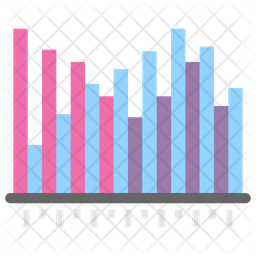
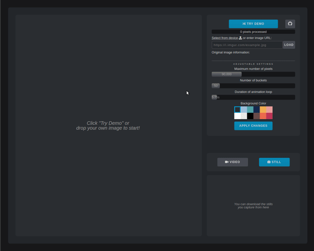
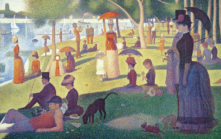

#  Animated Image Histogram

**[Animated Image Histogram](https://jaehyuk-lee.com/animated-image-histogram/ "Go to Animated Image Histogram")** creates an animation of the transition between a digital image and its [image histogram](https://en.wikipedia.org/wiki/Image_histogram).

Using only JavaScript and the canvas API, I replotted each pixel using its lightness value in the HSL color space as its new `x` coordinate and then stacked up all the pixels with similar lightness values and animated the transition using an interpolation function.

I packaged it with a responsive interface that allows users to intuitively adjust various parameters to customize their animation as well as take easy still and video captures of their animation.

## Demo Gifs

## Future Directions
* Incorporate WebGL for a more smooth animation and the ability to process higher resolutions.

## Contact
Created by [Jaehyuk Lee](mailto:jhlumd@gmail.com) based on [Anvaka](https://github.com/anvaka/gauss-distribution)'s Reddit post - feel free to contact me!